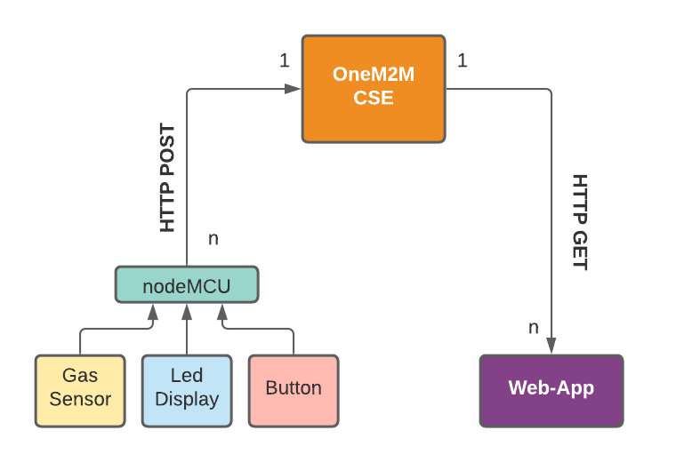
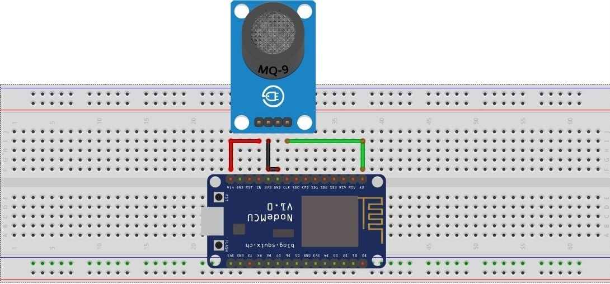

# ROTehc greenhouse gases IoT monitoring

## Problem

Greenhouse gases have far-ranging environmental and health effects. They cause climate change by trapping heat, and they also contribute to respiratory disease from smog and air pollution. Extreme weather, food supply disruptions, and increased wildfires are other effects of climate change caused by greenhouse gases.

CO2 is the gas that causes the most impact.

Human activity as combustion engines, fossil fuels or cement production generate huge amount of this gas.

## Solution

In order to contribute to the solution, our team decided to develop a centralized greengouse gases monitoring IoT system which would be of great help to governments to collect statistical data on pollution from each area in the city accurately and thus, know what measures to take in order to improve our situation and protect the people living there.

## Technology

Our system architecture is based on OneM2M Service Layer developed by engineers from European Telecomunications Standarts Instritute. There is a infrastructure node called CSE, a network of nodeMCU devices with gas sensors distribuited all over the territory, and an Infrastructure Application Entity to visualize the data.

### CSE

_TODO_

### nodeMCU

The nodeMCU is a low-cost open-source IoT platform. Its firmware runs on the ESP8266 Wi-Fi SoC.

This device has several gas sensors as MG-811 in order to measure the CO2 in air. It also counts with a LCD display to show some operational information.

Every nodeMCU sends its data every minute to the CSE over HTTP POST requests.

### in-AE

The infrastructure application entity consists of a web application written in JS which receives data from the CSE and displays it on a map.

Each nodeMCU has some coordinates associated with it. These points are distributed over the territory, forming cells according to Voronoi diagrams, to assign an region of ​​operation to each nodeMCU in an equitable way.

The app pulls every nodeMCU sensor data from the CSE, and plots it almost in real time.

## Demo

_TODO_

## Conclusion
