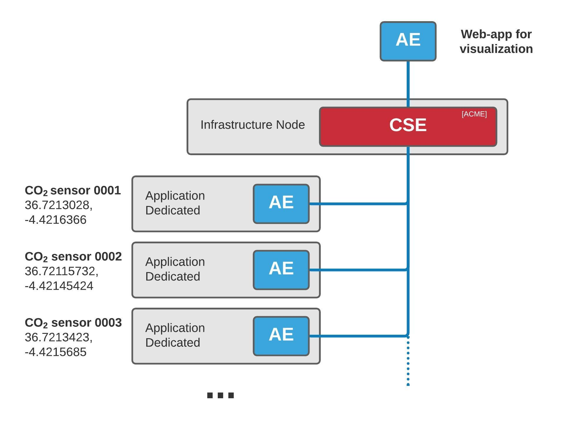
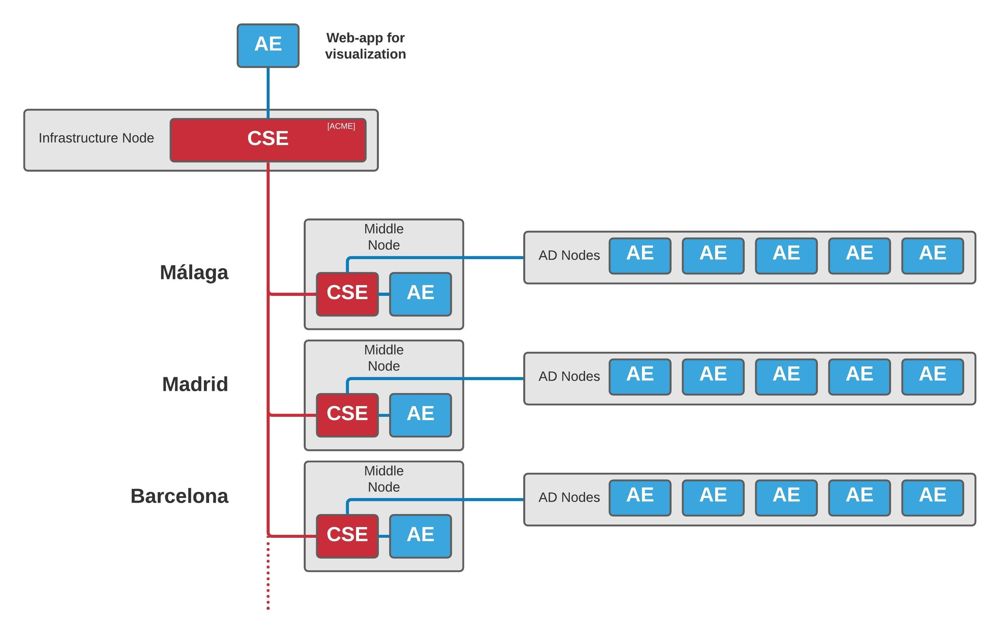
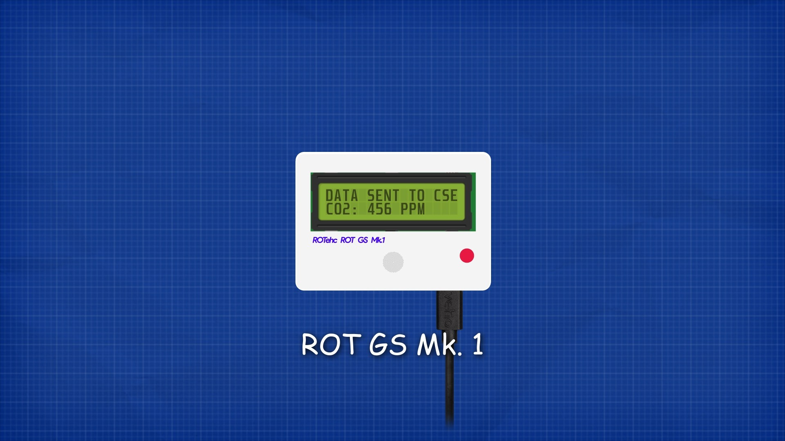
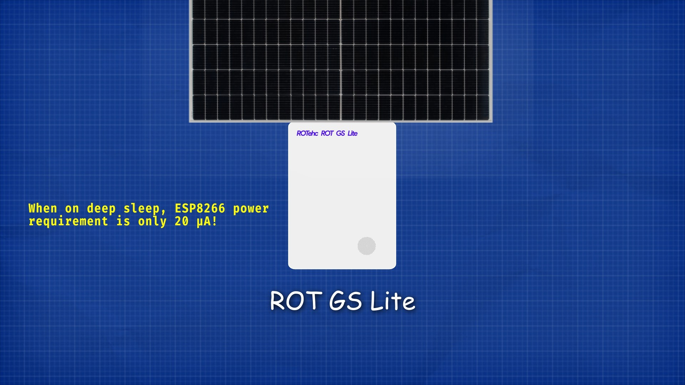
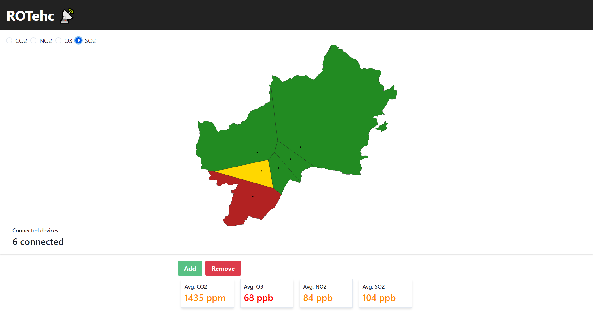
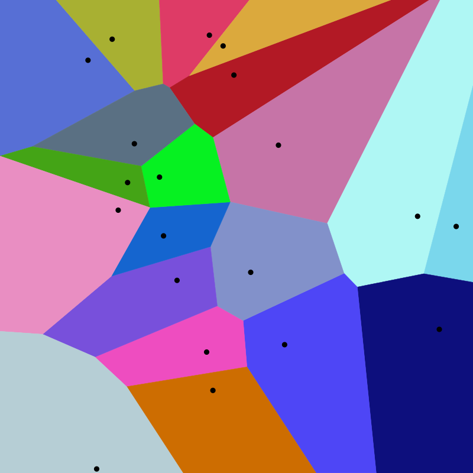
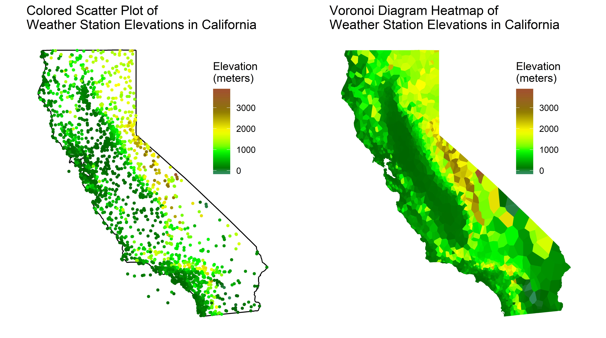

Implementation
===============

.. admonition:: Assumptions
	:class: warning

	- Security is not considered in the current implementation.

Our system architecture is based on OneM2M Service Layer developed by engineers from European Telecomunications Standards Institute. There is a infrastructure node called CSE, a network of nodeMCU devices with gas sensors distribuited all over the territory, and an Infrastructure Application Entity to visualize the data.

In the case of scaling the project nationwide, middle nodes could be created with their own CSE for each city. One of the advantages of OneM2M is its scalability.

.. warning:: The nationalwide architecture is only an idea, it was not implemented due to the limited scope of the Hackaton.

in-CSE: ACME
-------------

The institutioinal CSE is built over `ACME <https://github.com/ankraft/ACME-oneM2M-CSE>`_, an open-source light implementation of subset of oneM2M standard specializations written in Python.

.. image:: resources/acme_sm.png
	:align: center
	:width: 150

.. note:: To give this project more seriousness, the middleware was uploaded in a Docker container to Heroku: `https://rotehc-cse.herokuapp.com/ <https://rotehc-cse.herokuapp.com/>`_

Some modifications were needed to adapt the code to deploy it on Heroku. The code can be found in the ACME fork in our `organization GitHub <https://github.com/ROTehc/ACME-oneM2M-CSE>`_.

.. warning:: The container runs over free plan dyno, which means that if goes offline after 30 minutes of innactivity. If it's taking time to load, it means that the container is starting, so be patient. :)

AE: nodeMCU
------------

The nodeMCU is a low-cost open-source IoT platform. Its firmware runs on the ESP8266 Wi-Fi SoC.

This device has several gas sensors as MG-811 in order to measure the CO2 and other gases in air. It also counts with a LCD display to show some operational information.

.. warning:: As the time and budget were limited, it was not possible to buy the sensors, instead it was decided to simulate the signals by software in the nodeMCU itself.

The aspect of the first prototype would be like this:

It would consist of a rectangular case with all the components inside and a transparent region in order to see the LCD display. It would have a DC port in order to provide the power to the device.

For ocasions when the power supply is a problem, Lite version was developed. This version would be equiped with a 18650 battery and a small solar panel. In addition, the device wouldn't have LCD display and would enter in deep sleep when not in use to save energy.

	
Every nodeMCU sends its data every amount of time (defined by the user) to the CSE over HTTP POST requests.

.. warning:: This devices are only prototypes. Correct operation is not guaranteed.

in-AE
------

The infrastructure application entity consists of a web application written over Vue.js framework. The app fetches the data from the CSE and displays it on a map.

Each nodeMCU has some coordinates associated with it. These points are distributed over the territory, forming cells according to Voronoi diagrams.

A Voronoi diagram is a nearest neighbor diagram: given a set of generator points, the Voronoi diagram creates nearest neighbor cells. Each cell is formed around one generator point, and the set of points closest to that generator is fully contained in its cell. The resulting diagram can be used to find the nearest generator for an arbitrary point or to interpolate the blank space around each generator to create a heatmap.

In the following image it could be seen the advantages of a Voronoi diagram over a scatter plot:

The app also provides average gas concentrations and a selector of gases to show on map. The app pulls every nodeMCU sensor data from the CSE, and plots it.

.. note:: This app was also deployed online using Netlify platform: `https://elated-hugle-53ac94.netlify.app/ <https://elated-hugle-53ac94.netlify.app/>`_
