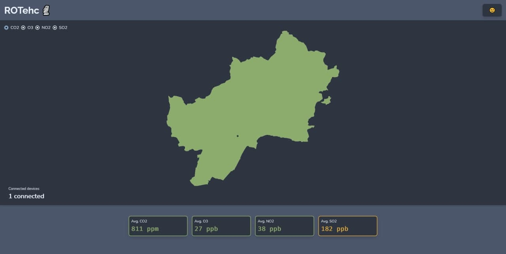

Implementation
===============

AE: nodeMCU
------------

The nodeMCU is a low-cost open-source IoT platform. Its firmware runs on the ESP8266 Wi-Fi SoC.

Sensor nodes
~~~~~~~~~~~~~

This device has several gas sensors as MG-811 in order to measure the CO2 and other gases in air. It also counts with a LCD display to show some operational information.

.. warning:: As the time and budget were limited, it was not possible to buy the sensors, instead it was decided to simulate the signals by software in the nodeMCU itself.

The aspect of the first prototype would be like this:

It would consist of a rectangular case with all the components inside and a transparent region in order to see the LCD display. It would have a DC port in order to provide the power to the device.

For ocasions when the power supply is a problem, Lite version was developed. This version would be equiped with a 18650 battery and a small solar panel. In addition, the device wouldn't have LCD display and would enter in deep sleep when not in use to save energy.

	
Every nodeMCU sends its data every amount of time (defined by the user) to the CSE over HTTP POST requests.

Each sensor node device, on first start, registers itself at the CSE with the information specified in the header of the .ino script, then creates the LOCATION container with its location, and then the DATA container. To avoid conflicts, the routine is aborted if the AE already exists at the CSE.

Each sensor node has its own container inside sensors group AE. Inside the nodes there are 2 containers, DESCRIPTOR and DATA:

- **LOCATION** has one content instance inside with the location of the device stored in JSON format:

.. code-block:: json

	{"lon": -4.45, "lat": 36.71}

- **DATA** its dedicated to store the readings from the device. Each content instance uses a JSON format to store all sensors readings:

.. code-block:: json

	{
	 "co2" : 658,
	 "o3" : 68,
	 "no2" : 116,
	 "so2" : 168
	}

Actuator nodes
~~~~~~~~~~~~~~~

When an Actuator Node boots create a container under the Smart App's Actuators container with a resource name specified in its configuration.

Then it will create a QUALITY container to store an Air Quality Index (AQI) and a LOCATION container where it will upload its position just once.

.. note:: The Actuator Node could be placed almost everywhere and show it's AQI value in a lot of different ways, making it a really flexible platform.

Once the QUALITY container has been created it will create a subscription to it in order to be notified every time a new relevant AQI is sent from the Smart App.

When a new AQI arrives at the Actuator Node, it will decide what to do based on the danger the AQI represents. Since the AQI goes from 1 (poor quality, high danger) to 10 (excellent quality, low danger), we can use color LEDs, display it on screens or even actuate servo motors to move indicators like a speedometer does.

.. math::
	AQI(x) = 11-\max\left({10\cdot\min\left({1,\frac{(x- \mathit{L})}{\mathit{H} - \mathit{L}}}\right),1}\right)

.. note:: :math:`L=low, H=high`

.. warning:: This devices are only prototypes. Correct operation is not guaranteed.

in-CSE: ACME
-------------

Our system architecture is based on OneM2M Service Layer developed by engineers from European Telecomunications Standards Institute. There is a infrastructure node called CSE, a group of nodeMCU devices with gas sensors, and another group with actuators, distribuited all over the territory, and an SmartApp as application entity to visualize the data.

The in-CSE is built over `ACME <https://github.com/ankraft/ACME-oneM2M-CSE>`_, an open-source light implementation of subset of oneM2M standard specializations written in Python.

.. image:: resources/acme_sm.png
	:align: center
	:width: 150

The resources tree is the following:

The CSE contains the AE SmartApp. This entity has two containers which are Sensors, and Actuators.

- The Sensors container stores all the sensor nodes, each node has a container storing its location in json format in the LOCATION container and the recorded measures in json format in the DATA container.
- The Actuators container stores all the actuator nodes, each actuator has two containers, LOCATION (same as in sensor nodes) and QUALITY. The QUALITY container stores the Air Quality Index which is calculated at the Smart App based in the nearest sensors readings, each node is subscribed to its own QUALITY container in order to show the last updated information. 
  
Smart app
----------

The web-app is written with Vue.js framework. The app fetches the data from the CSE, parses the JSON, and displays it on a map.

Each IoT device is plotted as a point on the map, forming cells for each node according to Voronoi diagrams.

A Voronoi diagram is a nearest neighbor diagram: given a set of generator points, the Voronoi diagram creates nearest neighbor cells. Each cell is formed around one generator point, and the set of points closest to that generator is fully contained in its cell. The resulting diagram can be used to find the nearest generator for an arbitrary point or to interpolate the blank space around each generator to create a heatmap.

In the following image it could be seen the advantages of a Voronoi diagram over a scatter plot:

.. image:: resources/california.jpeg

The app also provides average gas concentrations and a selector of gases to show on map. The app pulls every nodeMCU sensor data from the CSE, and plots it.

Backend
--------

The Smart App will be a backend service subscribed to the CSE.

Every time a new Sensor Node or Actuator Node is created in the CSE the Smart App will store its resource name and coordinates in two separate data structures, one for Sensor Nodes and another one for Actuator Nodes. This system makes the calculation of distances and AQI reporting really fast.

.. code-block:: typescript

	interface Coordinates {
		lat: number;
		lon: number;
	}

	interface Readings {
		co2: number;
		o3: number;
		no2: number;
		so2: number;
	}

	interface Node {
		coordinates: Coordinates;
	}

	interface SensorNode extends Node {
		readings: Readings;
	}

	interface ActuatorNode extends Node {
		closest: string;
	}

	const sensorNodes: Map<string, SensorNode> = new Map(); // rn => SensorNode
	const actuatorNodes: Map<string, ActuatorNode> = new Map(); // rn => ActuatorNode

When a new Sensor Node is created, the Smart App will add it to the sensorNodes map and update the actuatorNodes map so each actuator points to their closest sensor.

When a new Actuator Node is created, the Smart App will calculate just its closest sensor and then add it to the actuatorNodes map.

When new readings arrive at the CSE from a Sensor Node, the Smart App will filter the actuators and take those who have the reporting sensor's resource name as their closest sensor.

Then it will calculate the reading's AQI and send its value to the relevant actuators.

The Smart App will also be responsible for sending data to the frontend when requested.

The backends runs over `Deno <https://deno.land/>`_, a modern runtime for TypeScript.
