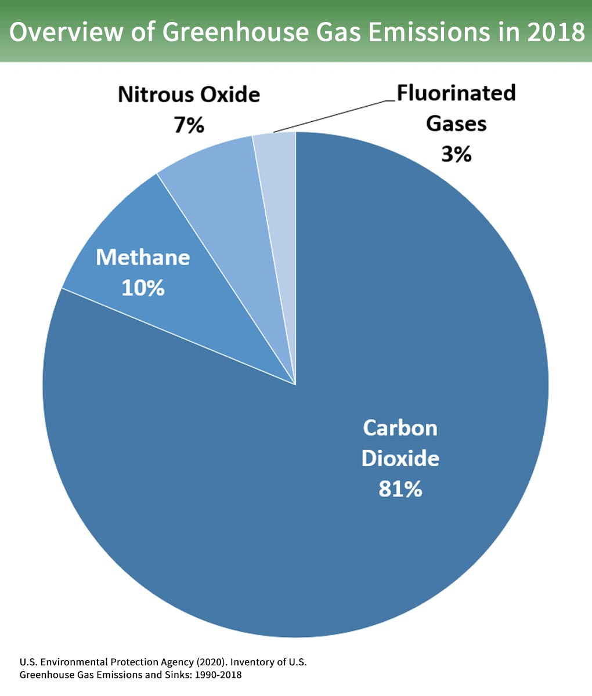

The problem
============

Greenhouse gases have far-ranging environmental and health effects. They cause climate change by trapping heat, and they also contribute to respiratory disease from smog and air pollution. Extreme weather, food supply disruptions, and increased wildfires are other effects of climate change caused by greenhouse gases.

CO2 is the gas that causes the most impact.

Human activity as combustion engines, fossil fuels or cement production generate huge amount of this gas.

The solution
-------------

In order to contribute to the solution, our team decided to develop a centralized greengouse gases monitoring IoT system which would be of great help to governments to collect statistical data on pollution from each area in the city accurately and thus, know what measures to take in order to improve our situation and protect the people living there.
